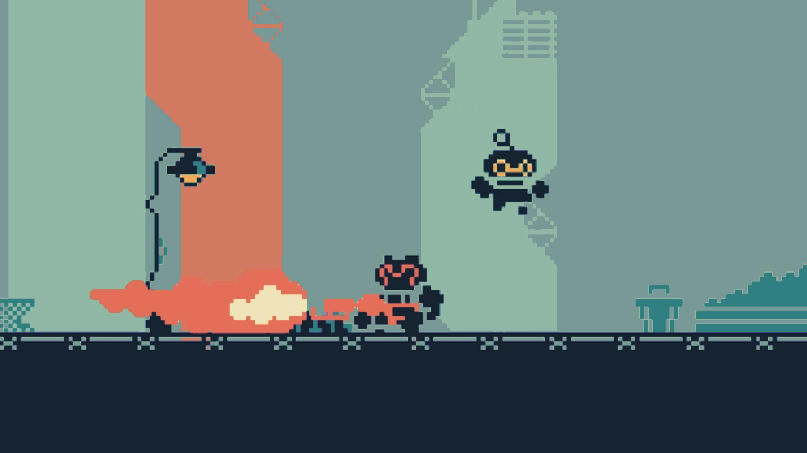

# Metroidvania: Escape the Factory

A compact pixel-art action platformer built with JavaScript and Kaboom.js. Explore connected factory rooms, fight patrol drones, defeat the burner boss, unlock a double jump, and find the exit.

**[Play the game](https://souravbanerjeedata.github.io/Metroidvania/)**



## Controls

| Action | Keyboard |
| --- | --- |
| Move | Left / Right arrows or **A / D** |
| Jump and double jump | **X** or **Space** |
| Attack | **Z** |
| Start | **Enter** |

## Run locally

The game uses ES modules and fetches its room maps, so open it from a local HTTP server instead of opening `index.html` as a file. From the repository root, run:

```sh
python -m http.server 8000
```

Then visit [http://localhost:8000](http://localhost:8000). No package installation or build step is needed; Kaboom.js is included in `lib/`.

## Project layout

- `src/entities/` — player, enemies, and pickups
- `src/scenes/` — rooms, camera behavior, collisions, and exits
- `src/state/` — game progress and player health
- `src/ui/` — HUD and in-game messages
- `maps/` — room artwork and Tiled JSON data
- `assets/` — sprites, sound, font, and tiles
- `lib/` — bundled Kaboom.js runtime

## Credits

The game uses Kaboom.js 3000.1.17. See [`assets/sounds/credit.txt`](./assets/sounds/credit.txt) for audio attribution. Art, font, and sound files are kept in the repository's `assets/` directory.
